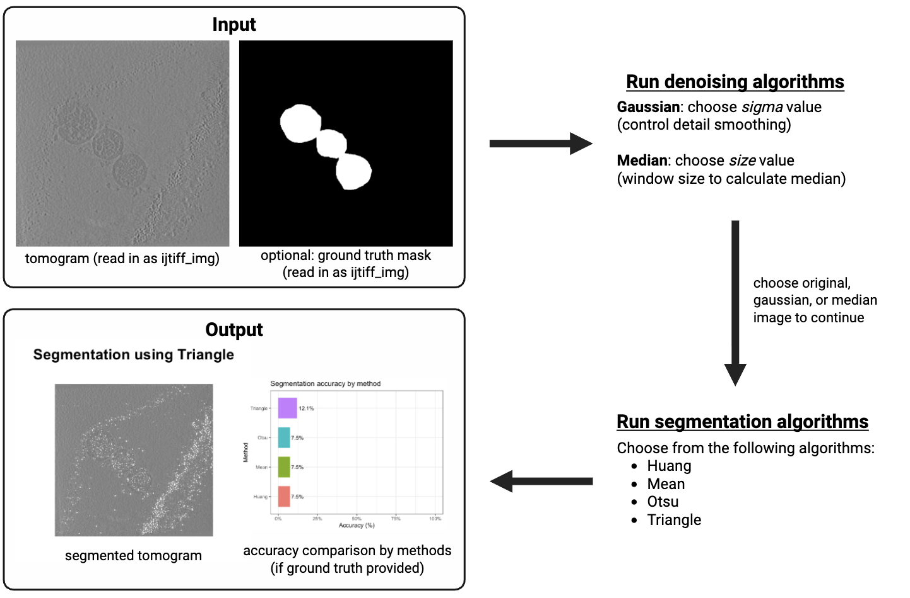

<!-- README.md is generated from README.Rmd. Please edit that file -->

# cryoCompare: comparisons for cryo-ET segmentation and denoising algorithms

<!-- badges: start -->

<!-- badges: end -->

Comparisons for cryo-ET segmentation and denoising algorithms for
BCB410H: Applied Bioinformatics and the Qu Lab.

## Description

cryoCompare is an R package designed to analyse cryo-electron tomography
(cryo-ET) data by comparing the performance of segmentation and
denoising algorithms. It improves current bioinformatics workflows by
providing a streamlined, standardised way to access algorithm accuracy
and visualise differences across denoising and segmentation methods,
which has not previously been available in R. The package was developed
using `R version 4.4.2 (2024-10-31)`,
`Platform: aarch64-apple-darwin20`, and `Running under: macOS 26.0.1`.

cryoCompare was developed as part of the BCB410H: Applied Bioinformatics
course at the University of Toronto, and for the Qu Lab at the National
University of Singapore.

## Installation

To install the latest version of the package:

``` r
install.packages("devtools")
library("devtools")
devtools::install_github("jeremyschan/cryoCompare", build_vignettes = TRUE)
library("cryoCompare")
```

To run the Shiny application:

``` r
runcryoCompare()
```

## Overview

``` r
ls("package:cryoCompare")
data(package = "cryoCompare")
browseVignettes("cryoCompare")
```

`cryoCompare` contains 5 functions:

1.  ***runPipeline*** for running the complete denoising and
    segmentation pipeline

2.  ***runDenoising*** for applying denoising algorithms to tomograms

3.  ***runSegmentation*** for applying segmentation algorithms to
    tomograms

4.  ***thresholdSegmentation*** for threshold-based segmentation of
    tomograms

5.  ***viewSegmentation*** for visualising segmentation results

The package contains some sample data from the CZ Biohub. Refer to the
package vignettes for more details. An overview of the package is
illustrated below.



## Contributions

The author of this package is Jeremy Chan. This project depends on and
builds upon several open‑source R packages whose functions and
algorithms are used throughout the implementation and analysis logic,
particularly EBImage (image processing), ijtiff (TIFF I/O),
autothresholdr (automatic thresholding), ggplot2 and base R
(visualisation), and other CRAN/Bioconductor packages used for data
manipulation and computation (e.g., dplyr). Credit for those functions,
algorithms, and helper utilities belongs to their respective package
authors; their contributions made the implementation, performance
comparisons, and many analysis choices possible. The example data is
derived from the Cryo‑ET Data Portal by CZ Biohub (Ke et al., 2018).
Generative AI was used only for proofreading, code optimisation
suggestions, and documentation assistance.

All higher‑level design decisions, original analysis logic, algorithms,
and the organisation of code in this repository are of the author’s
ideas. I wrote the core functions (runPipeline, runDenoising,
runSegmentation, thresholdSegmentation, viewSegmentation,
.compareGroundTruth), designed the end‑to‑end pipeline to standardise
comparisons across denoising and segmentation methods, implemented
input/output and preprocessing for tomograms and paired ground‑truth
data, and created examples and vignettes to demonstrate use. I also
added unit tests, example data, documentation, and package metadata to
make the project easy to install and reproduce.

## References

    Chang, W., Cheng, J., Allaire, J. J., Sievert, C., Schloerke, B., Xie, Y., Allen, J., McPherson, J., Dipert, A., & Borges, B. (2025). shiny: Web Application Framework for R. https://CRAN.R-project.org/package=shiny

    conditionalPanel demo. (n.d.) Shiny. https://shiny.posit.co/r/gallery/dynamic-user-interface/conditionalpanel-demo/

    Dice, L. R. (1945). Measures of the amount of ecological association between species. Ecology, 26(3), 297-302. https://doi.org/10.2307/1932409

    File Upload. (n.d.) Shiny. https://shiny.posit.co/r/gallery/widgets/file-upload/

    Glasbey, C. A. (1993). An analysis of histogram-based thresholding algorithms. CVGIP: Graphical Models and Image Processing, 55(6), 532-537. https://doi.org/10.1006/cgip.1993.1040

    Pau, G., Fuchs, F., Sklyar, O., Boutros, M., & Huber W. (2010). EBImage - an R package for image processing with applications to cellular phenotypes. Bioinformatics, 26(7), 979-981. https://doi.org/10.1093/bioinformatics/btq046

    Huang, L., & Wang, M. J. (1995). Image thresholding by minimizing the measures of fuzziness. Pattern Recognition, 28(1), 41-51. https://doi.org/10.1016/0031-3203(94)E0043-K.

    Huang, T., Yang, G., & Tang, G. (1979). A fast two-dimensional median filtering algorithm. IEEE Transactions on Acoustics, Speech, and Signal Processing, 27(1), 13-18. https://doi.org/10.1109/TASSP.1979.1163188

    Ke, Z., Oton, J., Qu, K., Cortese, M., Zila, V., McKeane, L., Nakane, T., Zivanov, J., Neufeldt, C. J., Cerikan, B., Lu, J. M., Peukes, J., Xiong, X., Kräusslich, H., Scheres, S. H. W., Bartenschlager, R., & Briggs, J. A. G. (2020). Structured and distributions of SARS-CoV-2 spike proteins on intact virions. Nature, 588, 498-502. https://doi.org/10.1038/s41586-020-2665-2

    Landini, G., Randell, D. A., Fouad, S., & Galton, A. (2017). Automatic thresholding from the gradients of region boundaries. Journal of Microscopy, 265(2), 185-195. https://doi.org/10.1111/jmi.12474

    Marr, D., & Hildreth, E. (1980). Theory of edge detection. Proceedings of the Royal Society B: Biological Sciences, 207(1167): 187-217. https://doi.org/10.1098/rspb.1980.0020

    Nolan, R., & Padilla-Parra, S. (2018). ijtiff: An R package providing TIFF I/O for ImageJ users. Journal of Open Source Software, 3(23), 633. https://doi.org/10.21105/joss.00633

    Otsu, N. (1979). A threshold selection method from gray-level histograms. IEEE Transactions on Systems, Man, and Cybernetics, 9(1), 62-66. https://doi.org/10.1109/TSMC.1979.4310076

    Tabsets. (n.d.) Shiny. https://shiny.posit.co/r/gallery/application-layout/tabsets/

    Weickert, J. (1998). Anisotropic diffusion in image processing. Stuttgart: Teubner.

    Wickham, H. (2016). ggplot2: Elegant graphics for data analysis. Springer-Verlag New York. https://ggplot2.tidyverse.org

    Wickham, H., François, R., Henry, L., Müller, K., & Vaughan, D. (2023). dplyr: A grammar of data manipulation. https://CRAN.R-project.org/package=dplyr

    Zack, G. W., Rogers, W. E., & Latt, S. A. (1977). Automatic measurement of sister chromatid exchange frequency. Journal of Histochemistry & Cytochemistry, 25(7), 741-753. https://doi.org/10.1177/25.7.70454

## Acknowledgements

This package was developed as part of an assessment for Fall 2025
BCB410H: Applied Bioinformatics course at the University of Toronto.
`cryoCompare` welcome issues, enhancement requests, and other
contributions. To submit an issue, use GitHub issues.

## Package Structure

The package tree structure is provided below:

``` r
- cryoCompare
  |- cryoCompare.rProj
  |- DESCRIPTION
  |- NAMESPACE
  |- LICENSE
  |- README
  |- data
     |- TS_001.133.tif
     |- TS_001.133_ground_truth.tif
  |- inst
     |- extdata
        |- readme_img.png
        |- TS_001.133.tif
        |- TS_001.133_ground_truth.tif
     |- shiny-scripts
        |- app.R
  |- man
     |- dot-compareGroundTruth.Rd
     |- runcryoCompare.Rd
     |- runDenoising.Rd
     |- runSegmentation.Rd
     |- viewSegmentation.Rd
     |- thresholdSegmentation.Rd
     |- runPipeline.Rd
     |- TS_001.133.Rd
     |- TS_001.133_ground_truth.Rd
  |- R
    |- data.R
    |- runDenoising.R
    |- runPipeline.R
    |- runSegmentation.R
    |- runcryoCompare.R
  |- vignettes
    |- Introduction_cryoCompare.Rmd
  |- tests
     |- testthat
         |- test-runDenoising.R
         |- test-runSegmentation.R
         |- test-thresholdSegmentation.R
         |- test-viewSegmentation.R
         |- test-runPipeline.R
    |- testthat.R
```
